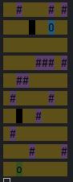
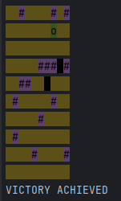

<!DOCTYPE html>
<html>

<body>
    <h1>Руководство по ChaseGame </h1>
    <h2>Содержание</h2>
    <ol>
        <li><a name="1" href="#1-1">Установка</a></li>
        <li><a name="2" href="#2-2">Запуск</a></li>
        <li><a name="4" href="#4-4">Описание</a>
            

                <ol>
                    <li><a name="4.1" href="#4-4-1">Ход игры</a></li>
                    <li><a name="4.2" href="#4-4-2">Исходы игры</a></li>
                    <li><a name="4.3" href="#4-4-3">Параметры</a></li>
                    <li><a name="4.3" href="#4-4-4">Настройки</a></li>
                </ol>
            

        </li>
        <li><a name="5" href="#5-5">Изображения</a></li>
    </ol>
    <h2>Установка</h2>
    
Чтобы установить игру перейдите в терминале сначала в папку ChaseLogic и выполните команду:

    <pre>mvn install</pre>
    
Затем перейдите в терминале в папку ChaseGame и выполните команду:

    <pre>mvn install</pre>
    
Итоговый jar файл будет находиться в папке ChaseGame/target под названием <b>game-jar-with-dependecies.jar</b>

    <h2>Запуск</h2>
    
Для использования/запуска игры перейдите в терминале в папку ChaseGame и выполните команду:

    <pre>java -jar target/game-jar-with-dependecies.jar --enemiesCount=2 --wallsCount=15 --size=10 --profile=production</pre>
    <h2>Описание</h2>
    <ul>
        <li><b>Ход игры</b>
            
Игрок рандомно появляется на игровом поле

            <ul>
                <li> Для передвижения используйте:</li>
                    <ul> W, w: вверх</ul>
                    <ul> S, s: вниз</ul>
                    <ul> A, a: влево</ul>
                    <ul> D, d: вправо</ul>
            </ul>
        </li>
        <li><b>Исходы игры</b>
            <ul>
                <li> <b>Победа</b>: Игрок дошел до целевого поля</li>
                <li> <b>Поражение</b>
                    <ul> Игрока поймали враги</ul>
                    <ul> У игрока нет пути до целевого поля</ul>
                    <ul> Игрок вышел за пределы поля</ul>
                </li>
            </ul>
        </li>
        <li><b>Параметры</b>
            
При запуске калькулятора необходимо использовать 4 параметра:

            <ul>
                <li> <b>enemiesCount</b>: устанавливает количество врагов</li>
                <li> <b>wallsCount</b>: устанавливает количество стен</li>
                <li> <b>size</b>: устанавливает ширину игрового поля</li>
                <li> <b>profile</b>: устанавливает режим игры
                    <ul><b>production</b>: Обычный режим игры</ul>
                    <ul><b>dev</b>: Режим разработчика</ul>
                </li>
            </ul>
        </li>
        <li><b>Настройки</b>
            
Можно изменять настройки игры путем изменения файлов .properties в ChaseGame/src/resources: 

            <ul>
                <li> Цвета элементоа</li>
                <li> Символы элементоа</li>
            </ul>
        </li>
    </ul>
    <h2>Изображения</h2>
    
Начало(черные клетки - враги)

    
    

    
Победа

    
</body>

</html>
